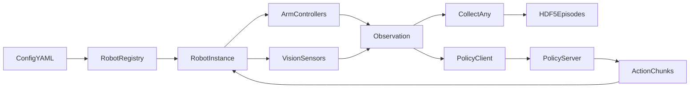
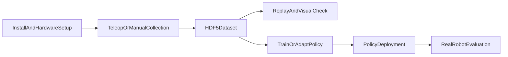
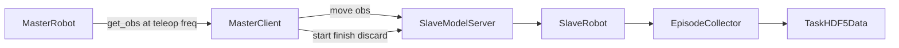
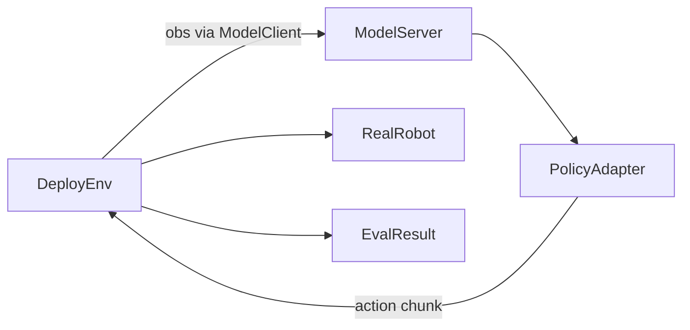

# Xspark AI X-One Pipeline

[](./README_XONE_CN.md)  
[](./README_XONE.md)

> This repository provides the usage code and complete documentation for the Xspark AI X-One platform. X-One is a robot learning platform that supports integrated master-slave control and teleoperation data collection. It integrates teaching collection, data storage, playback, and algorithm evaluation capabilities to build an end-to-end integrated workflow.
>
> X-One URDF/USD Repository: [https://github.com/XsparkAI/X-Arm-Description](https://github.com/XsparkAI/X-Arm-Description)
>
> If you have any questions, please contact us via [X-One Q&A Lark Group](https://applink.feishu.cn/client/chat/chatter/add_by_link?link_token=1f7l701d-8907-4bf2-9931-d1ec298a4abf) or WeChat `TianxingChen_2002`.

X-One Pipeline is an end-to-end runtime framework for real-world robot manipulation learning. It is not a single algorithm implementation. It is an engineering pipeline that connects real robot hardware, teleoperated demonstrations, multimodal dataset construction, trajectory replay, policy serving, and real-world evaluation.

It is designed for:

- Collecting real demonstrations with dual-arm X-One / Piper / PiperX platforms.
- Building episode-level datasets through master-slave teleoperation.
- Saving cameras, depth, joints, end-effector poses, grippers, and timestamps into HDF5.
- Deploying replay policies, custom policies, or OpenPI/VLA-style policies on real robots.
- Extending new robot embodiments, controllers, sensors, and policy adapters.

## Core Capabilities

- **Hardware abstraction**: A unified `Robot` interface organizes controllers, sensors, reset, move, replay, and collection.
- **Node-based collection**: Sensors and controllers can run at different frequencies, such as 30 Hz cameras and 200 Hz arms.
- **Master-slave teleoperation**: The master continuously streams joint and gripper states, while the slave executes, records, and saves episodes.
- **Multimodal data storage**: Data is saved as HDF5 by default, including JPEG images, depth, states, actions, and timestamps.
- **Policy deployment and evaluation**: Both local policy calls and remote `ModelServer` / `ModelClient` deployment are supported.
- **Extensible policy experiments**: `policy_lab/` includes replay policy, OpenPI policy, and custom policy templates.

## System Overview



A typical end-to-end loop:



The master-slave teleoperation path:



## Repository Structure

- `pipeline/`: entry points for collection, teleoperation, deployment, replay, reset, and visualization.
- `scripts/`: shell wrappers for installation, collection, replay, reset, and visualization.
- `config/`: YAML configs for robot embodiments and collection tasks.
- `src/task_env/`: collection, deployment, and local deployment environments.
- `src/robot/robot/`: robot definitions, registry, and node-based runtime wrapper.
- `src/robot/controller/`: arm, mobile base, dexterous hand, and other controllers.
- `src/robot/sensor/`: V4L2, Orbbec, Realsense, tactile, and other sensors.
- `src/robot/data/`: generic collection and HDF5 writing.
- `src/client_server/`: policy server and client communication.
- `policy_lab/`: policy adapters, model serving, and evaluation examples.
- `tools/`: camera scanning, USB/CAN rules, calibration, and peripheral utilities.
- `third_party/`: external SDKs, URDFs, gravity compensation, and hardware dependencies.

## Supported Hardware And Configs

The active robot registry is defined in `src/robot/robot/__init__.py`. The currently registered robot types that should be treated as primary entry points are:

- `dual_test_robot`: a test robot for minimal pipeline validation without real hardware.
- `x-one-piper-master`: Piper dual-arm master side, with arm control only and no cameras.
- `x-one-piperX-master`: PiperX dual-arm master side, with arm control only and no cameras.
- `x-one-piper-orbbec`: Piper dual-arm slave side with three Orbbec cameras.
- `x-one-piperX-orbbec`: PiperX dual-arm slave side with three Orbbec cameras.

Recommended configs:

- `config/x-one-piper-master.yml`
- `config/x-one-piperX-master.yml`
- `config/x-one-piper-orbbec.yml`
- `config/x-one-piperX-orbbec.yml`

The repository also keeps several legacy or pending configs, such as `config/x-one.yml`, `config/x-one-master.yml`, `config/x-one-mobile.yml`, and `config/x-one-hand.yml`. Their robot types are not all enabled in the current registry, so verify the corresponding robot class registration before running them directly.

## Installation

Basic requirements:

- Ubuntu 20.04 / 22.04.
- Python >= 3.10.
- ROS Noetic or ROS Humble, depending on the hardware SDK.
- Available CAN devices and camera devices.
- A separate GPU policy environment if running OpenPI/VLA-style policies.

Main installation flow:

```bash
bash scripts/install.sh
```

`scripts/install.sh` is interactive. Choose the installation items according to the current machine and hardware. If the machine does not have ROS installed yet, select the ROS installation item first, then continue with the required hardware SDKs. Y1 flows use different paths depending on the ROS version: Ubuntu 20.04 / ROS1 usually maps to `third_party/y1_sdk_python/y1_ros/`, while Ubuntu 22.04 / ROS2 usually maps to `third_party/y1_sdk_python/y1_ros2/`.

The script first installs this repository in editable mode, then optionally guides you through:

- Y1 arm SDK.
- Agilex Piper / PiperX, `pyAgxArm`, and gravity compensation dependencies.
- Orbbec camera SDK and udev rules.
- Wuji Retargeting.

Suggested checks after installation:

```bash
# Check Python imports
python -c "import robot; import policy_lab; print('X-One import OK')"

# Scan cameras
python tools/scan_camera.py

# Check CAN devices
bash tools/find_can_ports.sh
```

## Hardware Setup

### CAN And Arms

Piper / PiperX configs usually use `can_left` and `can_right`:

```yaml
robot:
  ROBOT_CAN:
    left_arm: can_left
    right_arm: can_right
```

If you use Y1 or legacy X-One configs, update the mapping to actual devices such as `can0`, `can1`, or `can2`.

#### Y1 / Legacy CAN Binding

For Y1 or legacy X-One arms, enter the CAN script directory that matches the system version:

```bash
# Ubuntu 20.04 / ROS1
cd third_party/y1_sdk_python/y1_ros/can_scripts/

# Ubuntu 22.04 / ROS2
cd third_party/y1_sdk_python/y1_ros2/can_scripts/
```

When querying serial numbers, plug in only one arm USB device at a time to avoid mixing left and right arm serials. Older operation notes mention that the official `search.sh` may have issues; if needed, remove lines 3-9 of that script before running:

```bash
bash search.sh
```

The output usually contains fields similar to:

```bash
Found ttyACM device
{idVendor}=="16d0"
{idProduct}=="117e"
{serial}=="20A6358B4543"
```

Record the `serial` value and write it into `imeta_y1_can.rules`. The legacy X-One convention maps the left arm to `imeta_y1_can0` and the right arm to `imeta_y1_can1`:

```bash
SUBSYSTEM=="tty", ATTRS{idVendor}=="16d0", ATTRS{idProduct}=="117e", ATTRS{serial}=="209435684543", SYMLINK+="imeta_y1_can0"
SUBSYSTEM=="tty", ATTRS{idVendor}=="16d0", ATTRS{idProduct}=="117e", ATTRS{serial}=="209431564563", SYMLINK+="imeta_y1_can1"
```

After writing the rules, run:

```bash
bash set_rules.sh
```

Then start CAN in two separate terminals:

```bash
bash start_can0.sh
bash start_can1.sh
```

During startup, you may first see `Cannot find device "can0"` and then `can0 started successfully`. This intermediate message does not necessarily mean failure; use the final CAN startup status as the source of truth.

Useful helper scripts:

```bash
bash tools/find_can_ports.sh
bash tools/can_multi_activate.sh
```

### Cameras

Piper / PiperX + Orbbec configs use three cameras:

```yaml
robot:
  CAMERA_SERIALS:
    head: "your_head_camera_serial"
    left_wrist: "your_left_wrist_camera_serial"
    right_wrist: "your_right_wrist_camera_serial"
```

Useful tools:

```bash
python tools/orbbec_serial.py
python tools/scan_camera.py
sudo python3 tools/set_camera_rules.py
```

Before every real data collection run, confirm that the camera bindings are still correct. For V4L2/USB cameras, use `tools/scan_camera.py` to inspect current devices and indices. For Orbbec cameras, use `tools/orbbec_serial.py` to inspect serial numbers. After confirmation, write the result into the corresponding config under `robot.CAMERA_SERIALS`.

Camera binding is not flashed into the camera. If you move to another computer, configure the bindings again. Common semantic device names are:

```text
/dev/head_camera
/dev/left_wrist_camera
/dev/right_wrist_camera
```

### Foot Pedals

Manual collection can be controlled with Enter, or through a foot pedal:

```yaml
collect:
  use_footpedal: true
  footpedal_serial: "/dev/pedal"
```

In master-slave teleoperation, the master side can use `pedal_right` to start and finish recording, and `pedal_left` to discard the previous episode.

## Quick Start

### Reset The Robot

Reset moves the robot to `robot.init_qpos` in the selected config.

```bash
bash scripts/reset.sh x-one-piperX-orbbec
```

`reset.sh <base_cfg>` reads `robot.init_qpos` from `config/<base_cfg>.yml`. Default configs are usually dual-arm all-zero joints with open grippers. On real hardware, first confirm that the pose is collision-free and within the safe range of the current workcell.

### Single-Machine Data Collection

```bash
bash scripts/collect.sh <task_name> <base_cfg>
```

Example:

```bash
bash scripts/collect.sh blocks x-one-piperX-orbbec
```

Start from a specific episode id:

```bash
bash scripts/collect.sh blocks x-one-piperX-orbbec --st_idx 100
```

Arguments:

- `task_name`: the current task name, used for task metadata and data directories.
- `base_cfg`: resolves to `config/<base_cfg>.yml`.
- `--st_idx`: optional starting episode id. If omitted, the collector searches existing HDF5 files and picks the next available id.

Runtime flow:

1. Load `config/<base_cfg>.yml`.
2. Create `CollectEnv`.
3. Call robot `reset()`.
4. Wait for Enter or foot pedal trigger.
5. Collect states and sensor data at `collect.save_freq`.
6. Trigger again to write the episode into HDF5.

Before real collection, run both camera binding checks and CAN checks. Older documentation described the data directory as `data/<base_cfg>/<task_name>`; the current implementation follows `CollectAny.write()`, so the default path is `data/<task_name>/<collect.type>/<episode_id>.hdf5`.

### Master-Slave Teleoperation Collection

Start the slave server first, then start the master controller.

This flow is intended for setups with two X-One platforms. For high-frequency communication and node-based collection, slave and master configs usually should set `robot.use_node=True`. The master side only sends high-frequency arm joint and gripper information, so it does not need camera bindings. The slave side performs the real execution and data logging, so it needs the camera config, collector config, and save path.

Slave side:

```bash
python pipeline/collect_teleop_slave.py \
  --task_name blocks \
  --slave_base_cfg x-one-piperX-orbbec \
  --ip 0.0.0.0 \
  --port 10000 \
  --visual
```

Master side:

```bash
python pipeline/collect_teleop_master.py \
  --master_base_cfg x-one-piper-master \
  --ip <slave_ip> \
  --port 10000 \
  --teleop_freq 50 \
  --visual
```

Teleoperation commands:

- `start`: start collecting one episode.
- `move`: continuously send master arm observations to the slave.
- `finish`: finish the current episode and save data.
- `discard_last_episode`: delete the previous collected episode.
- `reload_cameras`: reload cameras for recovery.

### Replay A Trajectory

```bash
bash scripts/replay.sh <task_name> <base_cfg> <idx>
```

Example:

```bash
bash scripts/replay.sh blocks x-one-piperX-orbbec 0
```

Replay targets a specific task, robot config, and trajectory id. Reset the robot before replay when possible. Replay reads `<idx>.hdf5` from the collection directory and sends the trajectory back to the robot at `collect.save_freq`; some observation fields from real collected data are intentionally not sent back as control commands.

### Visualize Data

Use the following entry points to inspect collected data:

```bash
bash scripts/vis_data.sh blocks x-one-piperX-orbbec 0 save/blocks_cam_head.mp4
python pipeline/rerun_visual.py data/blocks/x-one-piperX-orbbec/0.hdf5
```

Pass the fourth video save path to `scripts/vis_data.sh` when possible to avoid ambiguity in its optional argument handling. `pipeline/rerun_visual.py` requires an HDF5 file or folder path. `scripts/visual_hdf5.py` currently still uses a hardcoded `folder_path` inside the script; edit that variable first if you need to use it. For everyday checks, prefer `pipeline/rerun_visual.py` or `scripts/vis_data.sh`.

## Training And Evaluation

This repository focuses on real robot data collection, data inspection, replay, policy adaptation, and real robot evaluation. It does not currently include a full training pipeline, such as a unified `train.py`, OpenPI fine-tuning entry point, or LeRobot data conversion and training entry point. If you need to train OpenPI/VLA-style policies, train them in an external OpenPI, LeRobot, or custom training repository, then connect the resulting checkpoint through this repository's `policy_lab` deployment interface.

The evaluation and deployment entry points are included:

```bash
# Local debugging: policy and robot runtime run in the same process
python pipeline/deploy_local.py \
  --task_name demo_task \
  --policy_name openpi_policy \
  --base_cfg x-one-piperX-orbbec \
  --config_path policy_lab/openpi_policy/deploy.yml \
  --eval_episode_num 10 \
  --overrides \
  --train_config_name "pi05_full_base" \
  --model_path "/path/to/openpi/checkpoint"
```

You can also use `policy_lab/<policy_name>/eval.sh` as a server-client evaluation template. For OpenPI policies, make sure `train_config_name` and `model_path` are passed through the script or `deploy.yml`, because the OpenPI adapter requires them.

## Data Format

The default save path is determined by `collect.save_dir`, `collect.task_name`, and `collect.type`:

```text
data/<task_name>/<collect.type>/<episode_id>.hdf5
data/<task_name>/<collect.type>/config.json
```

Typical HDF5 layout:

```text
0.hdf5
├── left_arm
│   ├── joint
│   ├── eef
│   ├── gripper
│   └── timestamp
├── right_arm
│   ├── joint
│   ├── eef
│   ├── gripper
│   └── timestamp
├── cam_head
│   ├── color
│   ├── depth
│   └── timestamp
├── cam_left_wrist
│   ├── color
│   ├── depth
│   └── timestamp
└── cam_right_wrist
    ├── color
    ├── depth
    └── timestamp
```

Fields are declared by `set_collect_type()` in each robot class. For Piper + Orbbec slave robots, the common fields are:

- arm: `joint`, `eef`, `gripper`, `timestamp`.
- image: `color`, `depth`, `timestamp`.

`src/robot/utils/base/data_transform_pipeline.py` also provides optional data transformation pipelines:

- `X_spark_format_pipeline`: convert data into the Xspark structured format.
- `diff_freq_pipeline`: align cameras and arms collected at different frequencies.
- `general_hdf5_rdt_format_pipeline`: produce a more common imitation-learning HDF5 layout.

## Policy Deployment

X-One policy deployment separates the robot runtime from the policy runtime. The robot runtime handles real robot observations, action execution, and episode management. The policy runtime maps observations to action chunks.

The policy service structure is shown below. Currently, `pipeline/deploy.py` and `policy_lab/setup_policy_server.py` use `localhost` by default, so the server-client mode below is a same-machine deployment by default. Cross-machine remote serving requires an additional host parameter change or port forwarding.



### Policy Adapter Interface

Each policy directory should follow the `policy_lab/<policy_name>/` structure and provide:

- `__init__.py`: export `get_model()`.
- `deploy.py`: define `get_model(deploy_cfg)` and `eval_one_episode(TASK_ENV, model_client)`.
- `deploy.yml`: policy configuration.
- A policy implementation file, such as `your_policy.py` or `pi.py`.
- `eval.sh`: optional one-command evaluation script.

Use `policy_lab/replay_policy` as the minimal reference. In most cases, `deploy.yml` can be copied unless the policy needs extra input parameters. Keep the `deploy.py` and policy-class interfaces stable; do not casually change the call signatures of `get_model()`, `eval_one_episode()`, `update_obs()`, or `get_action()`.

The model object should implement:

- `update_obs(obs)`: update observation cache.
- `get_action(obs=None)`: return an action chunk.
- `reset()`: reset model state.
- `set_language(instruction)`: set the language instruction for language-conditioned policies.

Standard action format:

```python
{
    "arm": {
        "left_arm": {
            "joint": left_joint,
            "gripper": left_gripper,
        },
        "right_arm": {
            "joint": right_joint,
            "gripper": right_gripper,
        },
    }
}
```

### Local Deployment

Local deployment runs the policy and robot runtime in the same Python process, which is useful for debugging:

```bash
python pipeline/deploy_local.py \
  --task_name demo_task \
  --policy_name openpi_policy \
  --base_cfg x-one-piperX-orbbec \
  --config_path policy_lab/openpi_policy/deploy.yml \
  --eval_episode_num 10 \
  --overrides \
  --train_config_name "pi05_full_base" \
  --model_path "/path/to/openpi/checkpoint"
```

### Local Policy Server

Start the policy server:

```bash
python policy_lab/setup_policy_server.py \
  --config_path policy_lab/openpi_policy/deploy.yml \
  --port 10001 \
  --overrides \
  policy_name=openpi_policy \
  train_config_name=pi05_full_base \
  model_path=/path/to/openpi/checkpoint
```

Then run real robot evaluation:

```bash
python pipeline/deploy.py \
  --task_name demo_task \
  --base_cfg x-one-piperX-orbbec \
  --policy_name openpi_policy \
  --port 10001 \
  --eval_episode_num 10
```

### OpenPI Example

`policy_lab/openpi_policy/pi.py` shows how to map X-One observations to OpenPI-style inputs:

- Concatenate left and right `joint + gripper` into the state.
- Decode `cam_head`, `cam_left_wrist`, and `cam_right_wrist`.
- Build an observation with `state`, `images`, and `prompt`.
- Call OpenPI policy `infer()` to get an action chunk.
- Convert the action chunk back to X-One `arm.left_arm/right_arm` command format.

## MIT Control And Gravity Compensation (Advanced)

MIT control is an advanced feature for experienced users. Torque control on real robot arms is high risk; confirm emergency stop, support, payload, and workspace safety before use.

The older operation flow notes that MIT control requires updating `y1_sdk`, and currently only applies to ROS1 Noetic. To enable the MIT protocol, replace `Y1_controller` with `Y1mit_controller`. Returned data then includes joint torque information and the controller can command the arm through torque control.

If the corresponding SDK needs to be reinstalled, remove the old `third_party/y1_sdk_python/` first, then run:

```bash
bash scripts/install.sh
```

Example gravity compensation flow:

```bash
# Compile third_party/y1_mit/y1_cal.cpp into a shared library
g++ -O3 -fPIC -shared third_party/y1_mit/y1_cal.cpp -o libregressor.so

# Move it into the controller directory
cp libregressor.so src/robot/controller/

# Collect trajectories for torque computation
python -m src.robot.controller.Y1mit_controller

# Replay trajectories and compute parameters
python -m src.robot.controller.Y1mit_controller

# Test MIT gravity compensation
python -m src.robot.controller.Y1mit_controller
```

In practice, choose collection, replay, parameter computation, or gravity compensation test logic according to the main function in `src/robot/controller/Y1mit_controller.py`.

## Task Configuration

Task metadata is stored in `task_info/<task_name>.json`. Example:

```json
{
  "step_lim": 2000,
  "instructions": [
    "Move to the red cube.",
    "Go to the blue sphere.",
    "Navigate to the green pyramid."
  ]
}
```

During evaluation, `DeployEnv` reads this file:

- `step_lim` sets the maximum number of steps in an episode.
- `instructions` are randomly sampled for language-conditioned policies.

## Safety Notes

Before running real robots, check:

- Emergency stop, power, CAN cables, and camera cables.
- Both arms are in a collision-free initial pose.
- `robot.init_qpos` matches the safe range of the physical setup.
- Start the slave before the master in teleoperation.
- Do not mix master and slave configs; the master only sends joint information, while the slave performs execution and writes data.
- During CAN setup, plug in only one arm USB device at a time to avoid serial-number confusion.
- Reconfigure camera bindings after moving to another computer.
- Run camera scans and CAN checks before real collection.
- Confirm foot pedal trigger behavior before collecting data.
- Validate action format with replay or a test policy before deploying learned policies.

## Troubleshooting

### Robot Type Not Found

If the error says the robot type cannot be found, check:

- `robot.type` in `config/<base_cfg>.yml`.
- Whether that type is registered in `src/robot/robot/__init__.py`.

### CAN Device Cannot Connect

Check:

- Whether `ip link` shows the target CAN device.
- Whether `ROBOT_CAN.left_arm/right_arm` matches the real device mapping.
- Whether the arm is powered and the emergency stop is released.

### Piper Enable Fails

This is usually related to CAN mapping, arm power, emergency stop, or firmware feedback. Check:

- Whether `can_left` / `can_right` map to the correct USB-CAN adapters.
- Whether the arm drivers return valid status.
- Whether cabling and power are stable.

### Orbbec Camera Cannot Open

Check:

- Whether Orbbec udev rules are installed.
- Whether the device has been replugged after udev setup.
- Whether `CAMERA_SERIALS` match actual serial numbers.
- Whether another process is using the camera.

### Policy Server Connection Fails

Check:

- Whether `ModelServer` has started.
- Whether `host` and `port` match.
- Whether firewall or network settings block the connection.
- Whether the policy environment can import all model dependencies.

## Development Guide

### Add A New Robot

1. Add a robot class under `src/robot/robot/`.
2. Inherit from `Robot`, and define `controllers` and `sensors`.
3. Implement `set_up()` and `reset()`.
4. Call `set_collect_type()` to declare fields.
5. Register the type in `ROBOT_REGISTRY` in `src/robot/robot/__init__.py`.
6. Add a YAML config under `config/`.

### Add A New Controller

A controller should implement:

- `set_up()`: initialize hardware or SDK.
- `get_state()`: read current state.
- `set_joint()` / `set_position()` / `set_gripper()`: execute commands.
- `move_controller()`: dispatch action dicts.

### Add A New Sensor

A sensor should implement:

- `set_up()`: initialize the device.
- `get_information()` or `get_image()`: return structured observations.
- Optional `cleanup()`: release hardware resources.

### Add A New Policy

Copy `policy_lab/replay_policy` as the minimal template, or use `policy_lab/openpi_policy` as a reference for VLA-style policies. The key requirement is to keep the action dict compatible with robot controller inputs.

