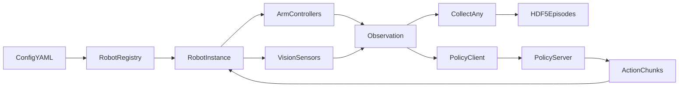
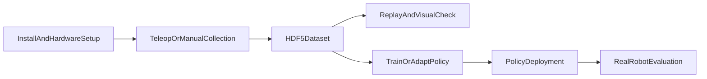
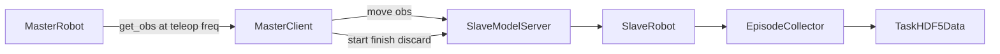
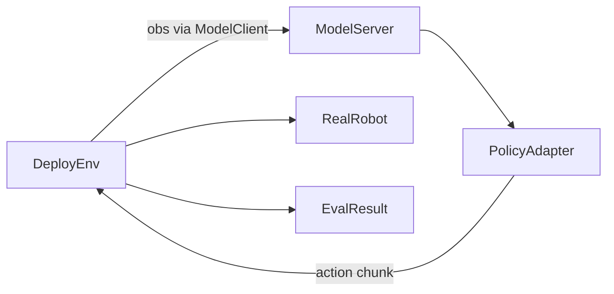

# Xspark AI X-One Pipeline

[](./README_XONE_CN.md)  
[](./README_XONE.md)

> 本仓库提供 Xspark AI X-One 平台的使用代码与完整文档。X-One 是一个支持主从一体控制与遥操作数据采集的机器人操作学习平台，集成示教采集、数据存储、回放与算法评测能力，构建端到端的一体化工作流。
> 
> X-One相关URDF/USD仓库：[https://github.com/XsparkAI/X-Arm-Description](https://github.com/XsparkAI/X-Arm-Description)
>
> 如果有任何使用问题，欢迎通过以下联系方式进行联系【[X-One答疑飞书群](https://applink.feishu.cn/client/chat/chatter/add_by_link?link_token=1f7l701d-8907-4bf2-9931-d1ec298a4abf)】或【微信联系方式 `TianxingChen_2002`】。

X-One Pipeline 是面向真实机器人操作学习的端到端运行框架。它不是单一算法实现，而是一套连接真实机器人硬件、遥操作示教、多模态数据集构建、轨迹回放、策略服务化部署与真实环境评测的工程管线。

它适合以下场景：

- 使用双臂 X-One / Piper / PiperX 平台采集真实示教数据。
- 通过主从遥操作构建 episode 级操作数据集。
- 将相机、深度、关节、末端位姿、夹爪和时间戳统一写入 HDF5。
- 将 replay policy、自定义策略或 OpenPI/VLA 类策略接入真实机器人评测。
- 扩展新的机器人本体、控制器、传感器或策略适配器。

## 核心能力

- **硬件抽象**：通过统一 `Robot` 接口组织 controller、sensor、reset、move、replay 和 collect 流程。
- **节点化采集**：支持传感器与控制器以不同频率运行，适合图像 30 Hz、机械臂 200 Hz 等异频系统。
- **主从遥操作**：master 端持续发送关节与夹爪状态，slave 端执行、采集并保存 episode。
- **多模态数据存储**：默认保存为 HDF5，支持相机 JPEG、深度图、状态、动作和时间戳。
- **策略部署评测**：提供本地策略调用和远端 `ModelServer` / `ModelClient` 两种部署方式。
- **可扩展策略实验**：`policy_lab/` 内置 replay policy、OpenPI policy 和自定义 policy 模板。

## 系统架构



一次完整闭环通常包括：



主从遥操作的数据链路如下：



## 目录结构

- `pipeline/`：数据采集、主从遥操作、部署、回放、复位和可视化入口。
- `scripts/`：常用 shell 封装，例如安装、采集、回放、复位、可视化。
- `config/`：不同机器人本体和采集任务的 YAML 配置。
- `src/task_env/`：采集环境、部署环境和本地部署环境。
- `src/robot/robot/`：机器人本体定义、registry 和节点化运行封装。
- `src/robot/controller/`：机械臂、移动底盘、灵巧手等控制器。
- `src/robot/sensor/`：V4L2、Orbbec、Realsense、触觉等传感器。
- `src/robot/data/`：通用数据采集与 HDF5 写入。
- `src/client_server/`：策略服务端和客户端通信。
- `policy_lab/`：策略适配、模型服务和评测示例。
- `tools/`：相机扫描、USB/CAN 规则配置、标定和外设工具。
- `third_party/`：外部 SDK、URDF、重力补偿和硬件依赖。

## 支持硬件与配置

当前代码的 active robot registry 位于 `src/robot/robot/__init__.py`。已注册并可作为优先入口的机器人类型包括：

- `dual_test_robot`：测试机器人，用于无真实硬件或最小链路验证。
- `x-one-piper-master`：Piper 双臂主端，仅机械臂控制，不绑定相机。
- `x-one-piperX-master`：PiperX 双臂主端，仅机械臂控制，不绑定相机。
- `x-one-piper-orbbec`：Piper 双臂从端，绑定三路 Orbbec 相机。
- `x-one-piperX-orbbec`：PiperX 双臂从端，绑定三路 Orbbec 相机。

推荐优先使用这些配置：

- `config/x-one-piper-master.yml`
- `config/x-one-piperX-master.yml`
- `config/x-one-piper-orbbec.yml`
- `config/x-one-piperX-orbbec.yml`

仓库中还保留了若干 legacy 或待确认配置，例如 `config/x-one.yml`、`config/x-one-master.yml`、`config/x-one-mobile.yml`、`config/x-one-hand.yml`。这些配置引用的 robot type 在当前 registry 中未全部启用，直接运行前需要先确认对应 robot class 是否已注册。

## 安装

基础要求：

- Ubuntu 20.04 / 22.04。
- Python >= 3.10。
- ROS Noetic 或 ROS Humble，取决于所用硬件 SDK。
- 可用 CAN 设备与相机设备。
- 如运行 OpenPI/VLA 类策略，需要单独准备 GPU 策略环境。

安装主流程：

```bash
bash scripts/install.sh
```

`scripts/install.sh` 是交互式安装脚本。执行后请根据当前电脑和硬件选择安装项；如果机器还没有 ROS 环境，需要先在脚本中选择 ROS 安装项，再继续选择对应硬件 SDK。Y1 相关流程会根据 ROS 版本使用不同目录：Ubuntu 20.04/ROS1 通常对应 `third_party/y1_sdk_python/y1_ros/`，Ubuntu 22.04/ROS2 通常对应 `third_party/y1_sdk_python/y1_ros2/`。

安装脚本会先以 editable mode 安装本仓库，然后按需引导安装：

- Y1 机械臂 SDK。
- Agilex Piper / PiperX、`pyAgxArm` 和重力补偿依赖。
- Orbbec 相机 SDK 和 udev 规则。
- Wuji Retargeting。

安装后建议做三类自检：

```bash
# 检查 Python 包是否可导入
python -c "import robot; import policy_lab; print('X-One import OK')"

# 扫描相机
python tools/scan_camera.py

# 检查 CAN 设备
bash tools/find_can_ports.sh
```

## 硬件配置

### CAN 与机械臂

Piper / PiperX 配置通常使用 `can_left` 和 `can_right`：

```yaml
robot:
  ROBOT_CAN:
    left_arm: can_left
    right_arm: can_right
```

如果使用 Y1 或旧 X-One 配置，需要根据实际 USB-CAN 映射修改为 `can0`、`can1`、`can2` 等。

#### Y1 / Legacy CAN 绑定流程

如果使用 Y1 或旧 X-One 机械臂，请按系统版本进入对应 CAN 脚本目录：

```bash
# Ubuntu 20.04 / ROS1
cd third_party/y1_sdk_python/y1_ros/can_scripts/

# Ubuntu 22.04 / ROS2
cd third_party/y1_sdk_python/y1_ros2/can_scripts/
```

查询序列号时建议只插入一只机械臂 USB，避免左右臂序列号混淆。旧实操记录中提到官方 `search.sh` 存在问题，必要时需要删除脚本第 3-9 行后再运行：

```bash
bash search.sh
```

输出通常包含类似字段：

```bash
Found ttyACM device
{idVendor}=="16d0"
{idProduct}=="117e"
{serial}=="20A6358B4543"
```

记录 `serial` 后写入 `imeta_y1_can.rules`。旧 X-One 约定左臂为 `imeta_y1_can0`，右臂为 `imeta_y1_can1`：

```bash
SUBSYSTEM=="tty", ATTRS{idVendor}=="16d0", ATTRS{idProduct}=="117e", ATTRS{serial}=="209435684543", SYMLINK+="imeta_y1_can0"
SUBSYSTEM=="tty", ATTRS{idVendor}=="16d0", ATTRS{idProduct}=="117e", ATTRS{serial}=="209431564563", SYMLINK+="imeta_y1_can1"
```

写入规则后运行：

```bash
bash set_rules.sh
```

随后在两个新终端中分别启动 CAN：

```bash
bash start_can0.sh
bash start_can1.sh
```

启动过程中可能先看到 `Cannot find device "can0"`，随后出现 `can0 started successfully`。这种中间日志不一定表示失败，应以最终 CAN 是否成功启动为准。

常用辅助脚本：

```bash
bash tools/find_can_ports.sh
bash tools/can_multi_activate.sh
```

### 相机

Piper / PiperX + Orbbec 配置使用三路相机：

```yaml
robot:
  CAMERA_SERIALS:
    head: "your_head_camera_serial"
    left_wrist: "your_left_wrist_camera_serial"
    right_wrist: "your_right_wrist_camera_serial"
```

常用工具：

```bash
python tools/orbbec_serial.py
python tools/scan_camera.py
sudo python3 tools/set_camera_rules.py
```

每次真实数据采集前，都建议确认相机绑定是否正确。V4L2/USB 相机可用 `tools/scan_camera.py` 查看当前设备和编号；Orbbec 相机可用 `tools/orbbec_serial.py` 查看序列号。确认后应将结果写入对应配置的 `robot.CAMERA_SERIALS`。

相机绑定不是烧录，更换电脑后需要重新配置。常见的三个语义设备位是：

```text
/dev/head_camera
/dev/left_wrist_camera
/dev/right_wrist_camera
```

### 脚踏开关

普通采集可通过 Enter 控制 episode 开始与结束，也可以在配置中启用脚踏：

```yaml
collect:
  use_footpedal: true
  footpedal_serial: "/dev/pedal"
```

主从遥操作中，master 端默认可使用 `pedal_right` 启停采集，`pedal_left` 删除上一条数据。

## 快速开始

### 复位机器人

复位会将机器人移动到配置文件中的 `robot.init_qpos`。

```bash
bash scripts/reset.sh x-one-piperX-orbbec
```

`reset.sh <base_cfg>` 会读取 `config/<base_cfg>.yml` 中的 `robot.init_qpos`。默认配置通常是双臂关节全 0、夹爪张开。真实硬件上请先确认该姿态不会发生碰撞，并且处于当前工位的安全范围内。

### 单机数据采集

```bash
bash scripts/collect.sh <task_name> <base_cfg>
```

示例：

```bash
bash scripts/collect.sh blocks x-one-piperX-orbbec
```

从指定 episode id 开始：

```bash
bash scripts/collect.sh blocks x-one-piperX-orbbec --st_idx 100
```

参数说明：

- `task_name`：当前任务名，会用于数据目录和任务信息索引。
- `base_cfg`：对应 `config/<base_cfg>.yml`。
- `--st_idx`：可选起始 episode id；如果不传，collector 会按已有 HDF5 文件自动寻找下一个可用 id。

运行逻辑：

1. 读取 `config/<base_cfg>.yml`。
2. 创建 `CollectEnv`。
3. 调用 robot `reset()`。
4. 等待 Enter 或脚踏触发。
5. 按 `collect.save_freq` 采集状态和传感器数据。
6. 再次触发后写入 HDF5。

真实采集前请先完成相机扫描和 CAN 检查。旧文档中曾按 `data/<base_cfg>/<task_name>` 描述数据目录；当前代码以 `CollectAny.write()` 为准，实际默认路径是 `data/<task_name>/<collect.type>/<episode_id>.hdf5`。

### 主从遥操作采集

建议先在 slave 机器上启动服务端，再在 master 机器上启动主控端。

该流程适用于拥有两套 X-One 平台的主从遥操作。为了支持高频通信与节点化采集，slave/master 配置通常建议开启 `robot.use_node=True`。master 端只负责高频发送机械臂关节和夹爪信息，因此不需要绑定相机；slave 端负责真实执行和数据落盘，因此需要配置相机、collector 和保存目录。

Slave 端：

```bash
python pipeline/collect_teleop_slave.py \
  --task_name blocks \
  --slave_base_cfg x-one-piperX-orbbec \
  --ip 0.0.0.0 \
  --port 10000 \
  --visual
```

Master 端：

```bash
python pipeline/collect_teleop_master.py \
  --master_base_cfg x-one-piper-master \
  --ip <slave_ip> \
  --port 10000 \
  --teleop_freq 50 \
  --visual
```

遥操作时的基本触发逻辑：

- `start`：开始采集一个 episode。
- `move`：持续发送 master 机械臂观测给 slave 执行。
- `finish`：结束当前 episode 并保存数据。
- `discard_last_episode`：删除上一条采集结果。
- `reload_cameras`：重新加载相机，用于相机异常恢复。

### 回放轨迹

```bash
bash scripts/replay.sh <task_name> <base_cfg> <idx>
```

示例：

```bash
bash scripts/replay.sh blocks x-one-piperX-orbbec 0
```

回放面向“指定任务 + 指定本体 + 指定轨迹 id”。运行前建议先复位机器人。回放时会读取采集目录中的 `<idx>.hdf5`，按 `collect.save_freq` 将轨迹重新发送到机器人；真实采集数据中的部分观测字段不会直接作为控制命令发送。

### 可视化数据

可以使用以下入口检查采集数据：

```bash
bash scripts/vis_data.sh blocks x-one-piperX-orbbec 0 save/blocks_cam_head.mp4
python pipeline/rerun_visual.py data/blocks/x-one-piperX-orbbec/0.hdf5
```

建议给 `scripts/vis_data.sh` 传入第 4 个视频保存路径，避免脚本内可选参数处理带来的歧义。`pipeline/rerun_visual.py` 必须传入 HDF5 文件或目录路径。`scripts/visual_hdf5.py` 当前仍使用脚本内硬编码的 `folder_path`，如需使用请先在脚本中修改该路径；日常检查优先使用 `pipeline/rerun_visual.py` 或 `scripts/vis_data.sh`。

## 训练与评测

本仓库主要提供真实机器人数据采集、数据检查、回放、策略适配和真实机器人评测流程；当前没有内置完整训练脚本，例如没有统一的 `train.py`、OpenPI fine-tuning 入口或 LeRobot 数据转换训练入口。若需要训练 OpenPI/VLA 类策略，通常需要在外部 OpenPI、LeRobot 或自研训练仓库中完成训练，再把 checkpoint 接入本仓库的 `policy_lab` 部署接口。

本仓库内置的是评测/部署入口：

```bash
# 本地调试：策略和机器人运行在同一进程
python pipeline/deploy_local.py \
  --task_name demo_task \
  --policy_name openpi_policy \
  --base_cfg x-one-piperX-orbbec \
  --config_path policy_lab/openpi_policy/deploy.yml \
  --eval_episode_num 10 \
  --overrides \
  --train_config_name "pi05_full_base" \
  --model_path "/path/to/openpi/checkpoint"
```

也可以使用 `policy_lab/<policy_name>/eval.sh` 启动 server-client 评测模板。注意，OpenPI 策略实际需要 `train_config_name` 和 `model_path`，如果使用 `eval.sh`，需要确认这些字段已经通过脚本或 `deploy.yml` 传入。

## 数据格式

默认保存路径由 `collect.save_dir`、`collect.task_name` 和 `collect.type` 共同决定：

```text
data/<task_name>/<collect.type>/<episode_id>.hdf5
data/<task_name>/<collect.type>/config.json
```

典型 HDF5 结构如下：

```text
0.hdf5
├── left_arm
│   ├── joint
│   ├── eef
│   ├── gripper
│   └── timestamp
├── right_arm
│   ├── joint
│   ├── eef
│   ├── gripper
│   └── timestamp
├── cam_head
│   ├── color
│   ├── depth
│   └── timestamp
├── cam_left_wrist
│   ├── color
│   ├── depth
│   └── timestamp
└── cam_right_wrist
    ├── color
    ├── depth
    └── timestamp
```

数据字段由 robot class 中的 `set_collect_type()` 决定。例如 Piper + Orbbec 从端通常采集：

- arm：`joint`、`eef`、`gripper`、`timestamp`。
- image：`color`、`depth`、`timestamp`。

`src/robot/utils/base/data_transform_pipeline.py` 中还提供了可选数据转换管线，例如：

- `X_spark_format_pipeline`：转换为 Xspark 结构化格式。
- `diff_freq_pipeline`：对不同频率的相机和机械臂数据做时间对齐。
- `general_hdf5_rdt_format_pipeline`：生成更接近通用 imitation learning 数据集的 HDF5 布局。

## 策略部署

X-One 的策略部署分为 robot runtime 和 policy runtime 两部分。robot runtime 负责真实机器人观测、动作执行和 episode 管理；policy runtime 负责根据观测返回 action chunk。

策略服务结构如下。当前 `pipeline/deploy.py` 和 `policy_lab/setup_policy_server.py` 默认使用 `localhost`，因此下面的 server-client 模式默认是同机部署；如需跨机器远端服务，需要额外改造 host 参数或使用端口转发。



### Policy adapter 接口

每个策略目录建议遵循 `policy_lab/<policy_name>/` 结构，并至少提供：

- `__init__.py`：导出 `get_model()`。
- `deploy.py`：定义 `get_model(deploy_cfg)` 和 `eval_one_episode(TASK_ENV, model_client)`。
- `deploy.yml`：策略配置。
- 策略实现文件，例如 `your_policy.py` 或 `pi.py`。
- `eval.sh`：可选的一键评测脚本。

最小策略目录可参考 `policy_lab/replay_policy`。通常 `deploy.yml` 可以直接复制，除非策略需要额外输入参数。请保持 `deploy.py` 与策略类的输入输出接口稳定，不要随意修改 `get_model()`、`eval_one_episode()`、`update_obs()`、`get_action()` 等函数的调用参数。

模型对象建议实现：

- `update_obs(obs)`：更新观测缓存。
- `get_action(obs=None)`：返回 action chunk。
- `reset()`：重置模型状态。
- `set_language(instruction)`：设置语言指令，语言条件策略可使用。

标准 action 格式：

```python
{
    "arm": {
        "left_arm": {
            "joint": left_joint,
            "gripper": left_gripper,
        },
        "right_arm": {
            "joint": right_joint,
            "gripper": right_gripper,
        },
    }
}
```

### 本地部署

本地部署将 policy 与 robot runtime 放在同一个 Python 进程中，适合调试：

```bash
python pipeline/deploy_local.py \
  --task_name demo_task \
  --policy_name openpi_policy \
  --base_cfg x-one-piperX-orbbec \
  --config_path policy_lab/openpi_policy/deploy.yml \
  --eval_episode_num 10 \
  --overrides \
  --train_config_name "pi05_full_base" \
  --model_path "/path/to/openpi/checkpoint"
```

### 本机策略服务

先启动策略服务：

```bash
python policy_lab/setup_policy_server.py \
  --config_path policy_lab/openpi_policy/deploy.yml \
  --port 10001 \
  --overrides \
  policy_name=openpi_policy \
  train_config_name=pi05_full_base \
  model_path=/path/to/openpi/checkpoint
```

再启动真实机器人评测：

```bash
python pipeline/deploy.py \
  --task_name demo_task \
  --base_cfg x-one-piperX-orbbec \
  --policy_name openpi_policy \
  --port 10001 \
  --eval_episode_num 10
```

### OpenPI 示例

`policy_lab/openpi_policy/pi.py` 展示了如何把 X-One 观测转成 OpenPI 风格输入：

- 将左右臂 `joint + gripper` 拼成 state。
- 解码 `cam_head`、`cam_left_wrist`、`cam_right_wrist`。
- 构造包含 `state`、`images` 和 `prompt` 的 observation。
- 调用 OpenPI policy `infer()` 获取 action chunk。
- 将 action chunk 转回 X-One 的 `arm.left_arm/right_arm` 控制格式。

## MIT 控制与重力补偿（高级）

MIT 控制是面向有经验用户的高级功能，真实机械臂力矩控制风险较高，使用前请确认急停、支撑、负载和运动空间安全。

旧实操流程中，MIT 控制需要更新 `y1_sdk`，并且当前只适用于 ROS1 Noetic。如果需要启用 MIT 协议，需要用 `Y1mit_controller` 替换 `Y1_controller`，在返回数据中增加关节力矩信息，并支持通过力矩控制机械臂。

如果需要重新安装对应 SDK，可先移除旧的 `third_party/y1_sdk_python/`，再运行：

```bash
bash scripts/install.sh
```

重力补偿示例流程：

```bash
# 编译 third_party/y1_mit/y1_cal.cpp 为 .so
g++ -O3 -fPIC -shared third_party/y1_mit/y1_cal.cpp -o libregressor.so

# 移动到 controller 目录
cp libregressor.so src/robot/controller/

# 采集轨迹用于后续力矩计算
python -m src.robot.controller.Y1mit_controller

# 回放轨迹并计算参数
python -m src.robot.controller.Y1mit_controller

# 测试 MIT 重力补偿
python -m src.robot.controller.Y1mit_controller
```

实际使用时需要根据 `src/robot/controller/Y1mit_controller.py` 中的 main 函数选择采集、回放、参数计算或重力补偿测试逻辑。

## 任务配置

任务信息存放在 `task_info/<task_name>.json`。示例：

```json
{
  "step_lim": 2000,
  "instructions": [
    "Move to the red cube.",
    "Go to the blue sphere.",
    "Navigate to the green pyramid."
  ]
}
```

评测时 `DeployEnv` 会读取该文件：

- `step_lim` 决定 episode 最大步数。
- `instructions` 用于语言条件策略的随机指令采样。

## 安全提示

真实机器人运行前请确认：

- 急停、供电、CAN 线缆和相机线缆状态正常。
- 双臂处于无碰撞初始姿态。
- `robot.init_qpos` 与现场硬件安全范围一致。
- 主从遥操作时先启动 slave，再启动 master。
- 主从遥操作时不要混用 master/slave 配置；master 只负责发送关节信息，slave 才是执行和数据落盘主体。
- CAN 配置时一次只插一个机械臂 USB，避免序列号混淆。
- 更换电脑后需要重新做相机绑定。
- 真实采集前先做相机扫描和 CAN 检查。
- 使用脚踏采集前先确认触发逻辑，避免误删 episode。
- 策略部署前先使用 replay 或测试策略验证动作格式。

## 常见问题

### 找不到 robot type

如果报错显示 `未找到机器人类型`，请检查：

- `config/<base_cfg>.yml` 中的 `robot.type`。
- `src/robot/robot/__init__.py` 中是否注册了该 type。

### CAN 设备无法连接

检查：

- `ip link` 是否能看到目标 CAN。
- `ROBOT_CAN.left_arm/right_arm` 是否与实际设备一致。
- 机械臂是否上电，急停是否释放。

### Piper enable 失败

通常与 CAN 映射、机械臂供电、急停、固件反馈有关。优先检查：

- `can_left` / `can_right` 是否对应正确 USB-CAN。
- 机械臂驱动器是否返回状态。
- 线缆和电源是否稳定。

### Orbbec 相机无法打开

检查：

- 是否安装了 Orbbec udev 规则。
- 是否重新插拔过设备。
- `CAMERA_SERIALS` 是否与实际序列号一致。
- 是否有其他进程占用相机。

### 策略服务连接失败

检查：

- `ModelServer` 是否已启动。
- `host`、`port` 是否一致。
- 防火墙或网络是否阻止连接。
- policy 环境是否能正确导入模型依赖。

## 开发扩展

### 新增机器人

1. 在 `src/robot/robot/` 下新增 robot class。
2. 继承 `Robot`，定义 `controllers` 和 `sensors`。
3. 实现 `set_up()` 和 `reset()`。
4. 调用 `set_collect_type()` 声明采集字段。
5. 在 `src/robot/robot/__init__.py` 的 `ROBOT_REGISTRY` 中注册。
6. 在 `config/` 下新增对应 YAML。

### 新增控制器

控制器应实现：

- `set_up()`：初始化硬件或 SDK。
- `get_state()`：读取当前状态。
- `set_joint()` / `set_position()` / `set_gripper()`：执行动作。
- `move_controller()`：根据 action dict 分发控制。

### 新增传感器

传感器应实现：

- `set_up()`：初始化设备。
- `get_information()` 或 `get_image()`：返回结构化观测。
- 可选 `cleanup()`：释放硬件资源。

### 新增策略

推荐复制 `policy_lab/replay_policy` 作为最小模板，或参考 `policy_lab/openpi_policy` 接入 VLA 类策略。关键是保持 action dict 与 robot controller 的输入格式一致。

